# DeadlockHelper

**Développeur :** Anthony Boily — Projet de fin d'études, ESP (2025-2026)

Application de bureau multiplateforme (Linux · Windows) qui offre un avantage tactique aux joueurs de Deadlock (Valve). Elle agrège les données communautaires en temps réel, intègre un gestionnaire multimédia Spotify et propose un hub de connaissances exhaustif sur les héros, les items et les statistiques de classement...

---

## Installation et configuration

### Prérequis système

- **Node.js ≥ 18** avec npm (gestionnaire de paquets JavaScript)
- **Python 3.12** pour le traitement des données de match (`src/python/`) et le worker OCR optionnel (`ocr-worker/`)
- **Git** pour cloner le dépôt

### 1. Dépendances Node.js

```bash
git clone https://github.com/DireDoch/DeadlockHelper.git
cd DeadlockHelper
npm install
```

`npm install` installe Electron, Vite, Tailwind CSS, electron-store et toutes les dépendances listées dans `package.json`. Le résultat est placé dans `node_modules/` (non versionné).

### 2. Variables d'environnement

Créez un fichier `.env` à la racine du projet à partir du modèle ci-dessous. Ces valeurs ne sont jamais baked dans le binaire de production (voir [Choix technique — Spotify OAuth](#choix-technique--spotify-oauth-avec-credential-override-au-runtime)).

```env
STEAM_API_KEY=votre_clé_steam_web_api
SPOTIFY_CLIENT_ID=votre_client_id_spotify
SPOTIFY_CLIENT_SECRET=votre_client_secret_spotify
SPOTIFY_REDIRECT_URI=http://127.0.0.1:30765/spotify/callback
```

La clé Steam est obtenue sur [steamcommunity.com/dev/apikey](https://steamcommunity.com/dev/apikey). Les identifiants Spotify sont créés dans le [Spotify Developer Dashboard](https://developer.spotify.com/dashboard) — ajoutez `http://127.0.0.1:30765/spotify/callback` dans les Redirect URIs autorisées.

### 3. Environnement Python — traitement des données de match

Le script `src/python/data_processor.py` est appelé par Electron pour interroger l'API Deadlock communautaire. Il nécessite un environnement virtuel Python isolé.

```bash
python3.12 -m venv src/python/venv
source src/python/venv/bin/activate   # Linux/macOS
# src\python\venv\Scripts\activate    # Windows
pip install -r src/python/requirements.txt
deactivate
```

Le fichier `src/python/requirements.txt` liste les dépendances Python du processeur de données (requêtes HTTP, formatage JSON). Electron appelle ce script via `python-runner.ts` en passant le chemin du venv au runtime — aucune installation globale de paquets n'est requise.

### 4. (Optionnel) Worker OCR — roster live en partie

Le worker OCR (`ocr-worker/`) lit l'écran du jeu pour détecter les héros en temps réel. Il est **non activé par défaut** dans le binaire de production (voir [Réflexion technique — OCR](#réflexion-technique--worker-ocr-roster-live)). Pour l'utiliser en développement :

```bash
python3.12 -m venv ocr-worker/venv
source ocr-worker/venv/bin/activate
pip install -r ocr-worker/requirements.txt   # installe EasyOCR + PyTorch CPU (~1.5 Go)
deactivate
```

### 5. Lancement en développement

```bash
npm start
```

Cette commande lance Vite (compilateur TypeScript + Tailwind) et Electron simultanément via Electron Forge. Toute modification du processus principal (`src/main/`) nécessite de relancer `npm start` — le Hot Module Replacement ne s'applique qu'au renderer.

### 6. Build de production

```bash
npm run make
```

Génère un binaire distributable (AppImage sur Linux, installeur sur Windows) dans `out/`. Le CI GitHub Actions (`release.yml`) exécute ce build automatiquement à chaque tag Git `v*.*.*`.

---

## Architecture

DeadlockHelper repose sur l'architecture Electron standard : un **processus principal** (Main Process, Node.js) et un **processus de rendu** (Renderer Process, navigateur Chromium). Les deux communiquent exclusivement via des canaux IPC nommés, sans partage de mémoire directe.

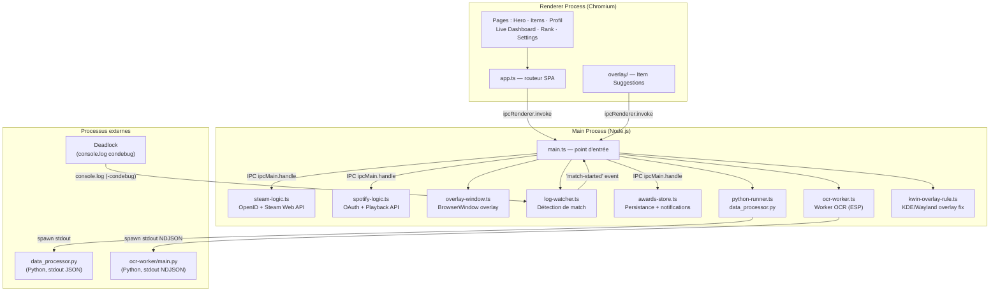

### Flux IPC principaux

Le processus principal expose ses capacités au renderer via `ipcMain.handle()`. Chaque canal suit la convention `domaine:action` et retourne une promesse.

| Canal | Direction | Payload | Description |
|---|---|---|---|
| `python:execute` | renderer → main | `{ query, param, mockMode }` | Exécute `data_processor.py` — retourne JSON ou données en cache |
| `game:get-status` | renderer → main | — | État courant : `{ isRunning, inMatch, matchId, state }` |
| `game:state-changed` | main → renderer | `{ state: GameState, matchId? }` | Transition d'état du jeu (CLOSED → MENU → IN_MATCH) |
| `game:match-started` | main → renderer | `{ matchId, timestamp }` | Match détecté (log ou API) |
| `game:match-ended` | main → renderer | `{ matchId, timestamp }` | Fin de match détectée |
| `steam:startAuth` | renderer → main | — | Lance le flux OpenID Steam, retourne `{ success, steamId64 }` |
| `steam:getProfile` | renderer → main | — | Profil Steam persisté `{ steamId64, avatarUrl, personaname }` |
| `spotify:login` | renderer → main | — | Lance le flux OAuth Spotify via serveur local 127.0.0.1 |
| `spotify:getCurrentlyPlaying` | renderer → main | — | Piste Spotify en cours `{ title, artist, albumArtUrl, ... }` |
| `awards:get-all` | renderer → main | — | Tous les awards gagnés `Record<AwardId, AwardEntry>` |
| `awards:save-batch` | renderer → main | `AwardEntry[]` | Fusionne les nouveaux awards, retourne les entrées réellement nouvelles |
| `awards:navigate` | main → renderer | — | Navigation vers l'onglet Awards (clic sur notification native) |
| `overlay:match-data` | main → overlay | `{ matchId, startWallTime, playerHeroId, enemyHeroIds }` | Données de match vers la fenêtre overlay |
| `esp:set-enabled` | renderer → main | `boolean` | Active/désactive le worker OCR roster |

---

## Aperçu des fonctionnalités

### Bibliothèque de héros

La grille principale liste tous les héros jouables de Deadlock, filtrés depuis `GET https://api.deadlock-api.com/v1/assets/heroes` (`player_selectable=true`, `disabled=false`). Chaque carte affiche le portrait, le nom et le type de héros. Un clic ouvre la page de détail avec cinq onglets : Builds, Items, Skill Path, Overview & Abilities, Lore.

<p align="center">
  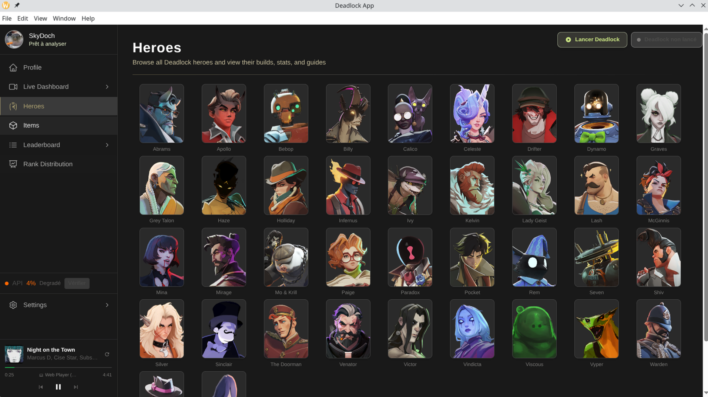
  <br/>
  <em>Bibliothèque de héros — grille de tous les personnages jouables, filtrée via l'API communautaire</em>
</p>

### Builds communautaires et analyse

Les trois builds les plus populaires de la semaine sont récupérés depuis `GET /v1/builds?hero_id={id}&sort_by=weekly_favorites&limit=3`, puis enrichis avec le taux de victoire via `GET /v1/analytics/hero-build-stats/{hero_id}`. Le build au meilleur winrate reçoit un badge **Recommended**. La barre de répartition Dégâts Gun/Spirit, l'ordre de déverrouillage des compétences et les items core sont affichés dans un résumé compact, suivi de la grille complète des items par catégorie.

<p align="center">
  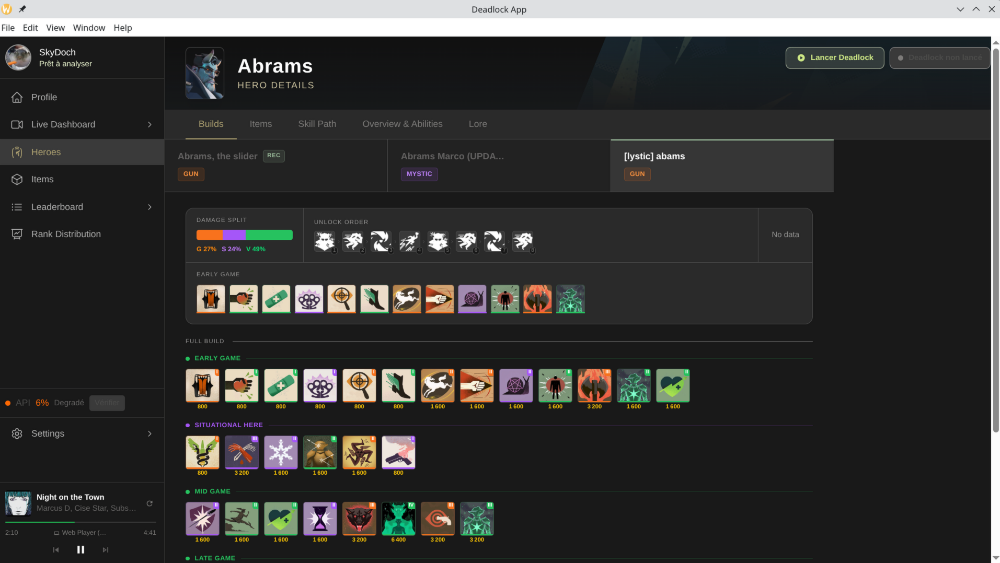
  <br/>
  <em>Builds communautaires — résumé des items core, répartition Gun/Spirit et ordre de déverrouillage des compétences</em>
</p>

### Overview & Abilities

L'onglet Overview & Abilities affiche les statistiques de combat de base (clip size, bullet damage, max health, move speed) et les quatre compétences signature. Chaque compétence sélectionnable révèle un panneau détaillé : description en texte enrichi avec mise en évidence des effets de statut, paliers d'amélioration T1/T2/T3, statistiques dynamiques clés et cooldown. L'Ultimate est distinguée par un effet de lueur dorée pulsante. Toutes les données proviennent du cache de la session — zéro appel API supplémentaire.

<p align="center">
  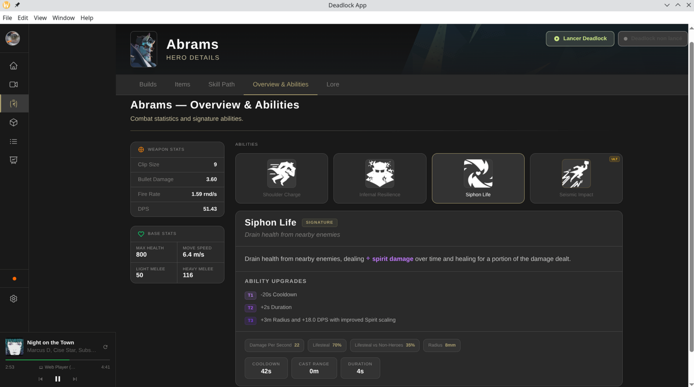
  <br/>
  <em>Overview & Abilities — statistiques de combat et panneau détaillé de compétence avec effets de statut mis en évidence</em>
</p>

### Live Dashboard

Le Live Dashboard suit une partie en cours en temps réel. Dès qu'un `match_id` est détecté (voir [Détection de match](#choix-technique--détection-de-match-par-log-watching)), les métadonnées du match sont récupérées depuis `GET /v1/matches/{id}/metadata`. Les onglets Overview, Lane Stats, Economy, Damage et Items présentent les statistiques de chaque joueur, enrichies des noms Steam depuis le cache local (TTL 7 jours, canal `player-names:get-many`).

<p align="center">
  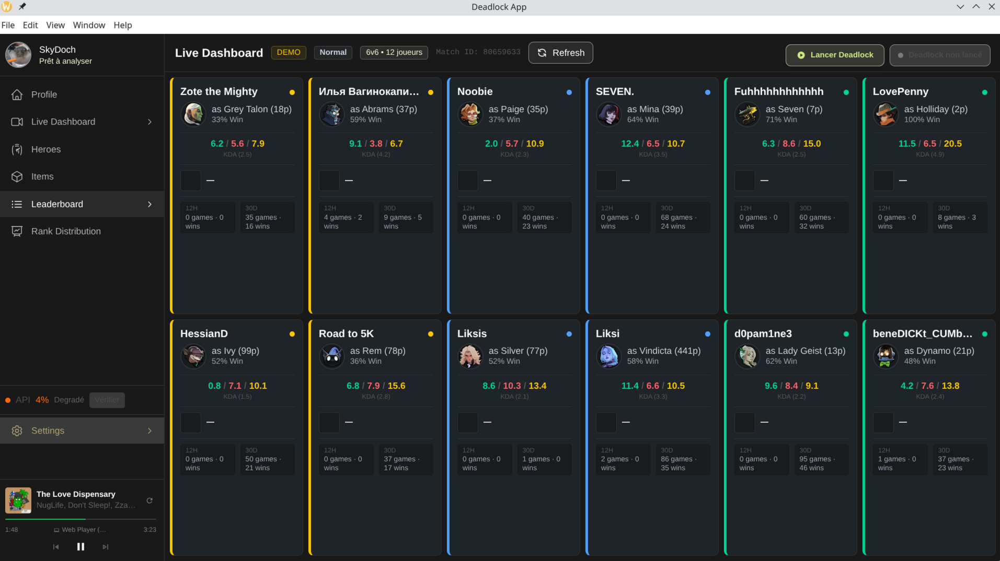
  <br/>
  <em>Live Dashboard — vue Overview d'une partie en cours avec statistiques par joueur et noms Steam</em>
</p>

<p align="center">
  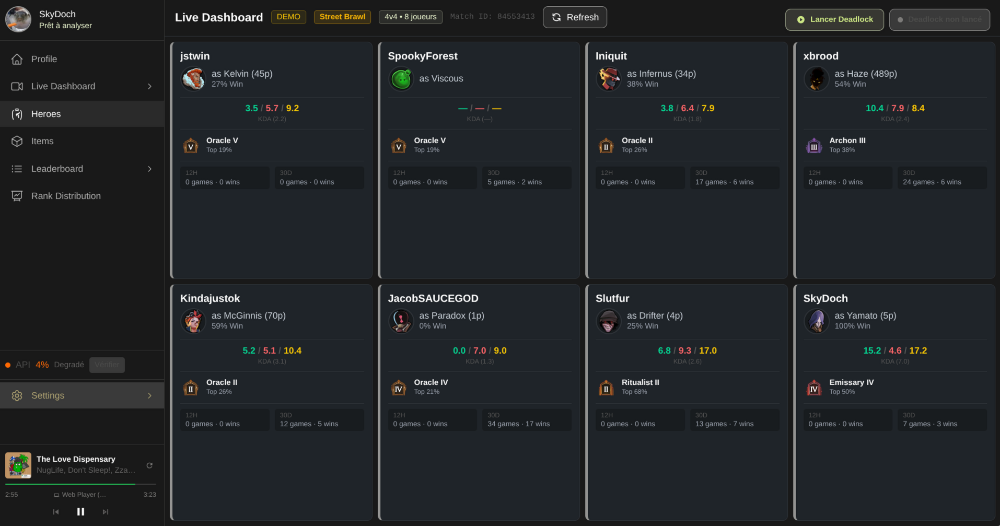
  <br/>
  <em>Live Dashboard — mode Street Brawl (4v4), layout adaptatif à la taille de l'équipe</em>
</p>

### Profil et Awards

La page Profil affiche le compte Steam authentifié (avatar, personaname, SteamID) ainsi que l'historique des matchs récents. L'onglet Awards évalue chaque match terminé selon 53 critères de performance (dégâts par minute, kills, souls, participation aux kills, etc.) et attribue des récompenses classées par rareté : Épique, Rare, Peu Commun, Commun, Infâme. Une notification native du système d'exploitation est déclenchée à chaque nouveau award gagné.

<p align="center">
  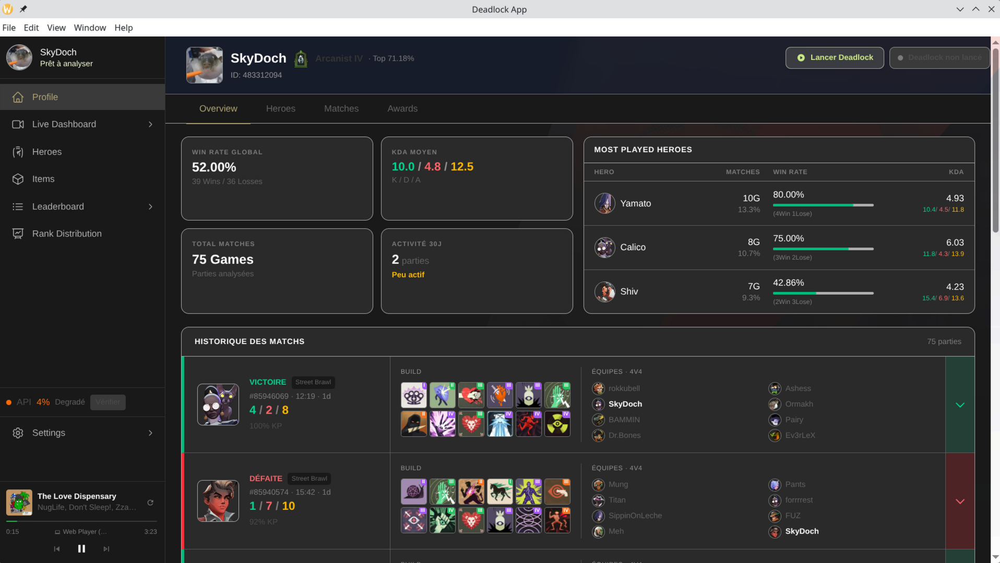
  <br/>
  <em>Profil — vue d'ensemble avec historique des matchs, rang estimé et statistiques de compte Steam</em>
</p>

<p align="center">
  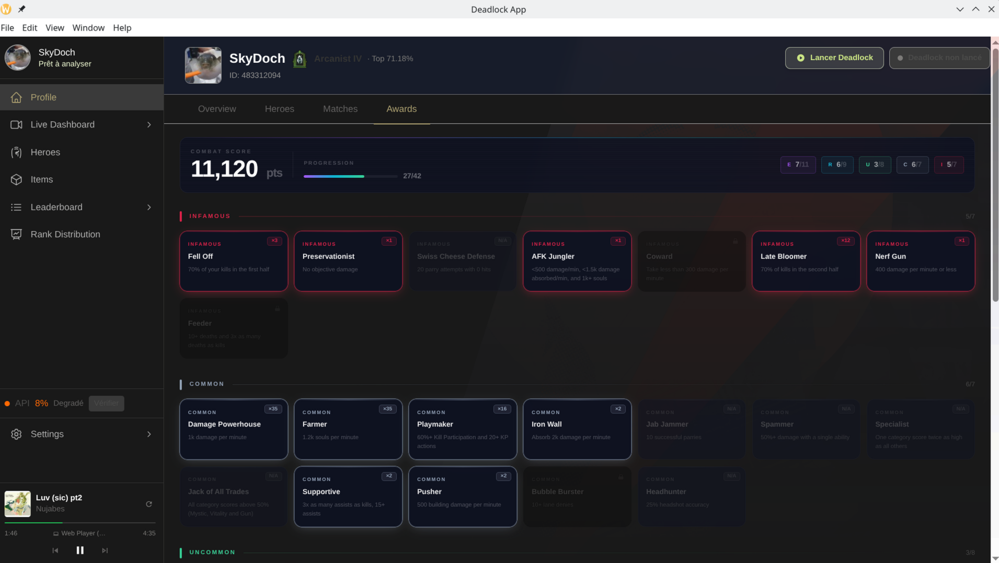
  <br/>
  <em>Awards — récompenses de performance calculées sur l'historique de matchs, classées par rareté (Épique → Infâme)</em>
</p>

### Distribution des rangs

La page Rank Distribution affiche la répartition globale des joueurs de Deadlock par rang, depuis `GET /v1/analytics/rank-distribution`. Un survol de chaque tranche de rang révèle le pourcentage de joueurs et le seuil MMR correspondant.

<p align="center">
  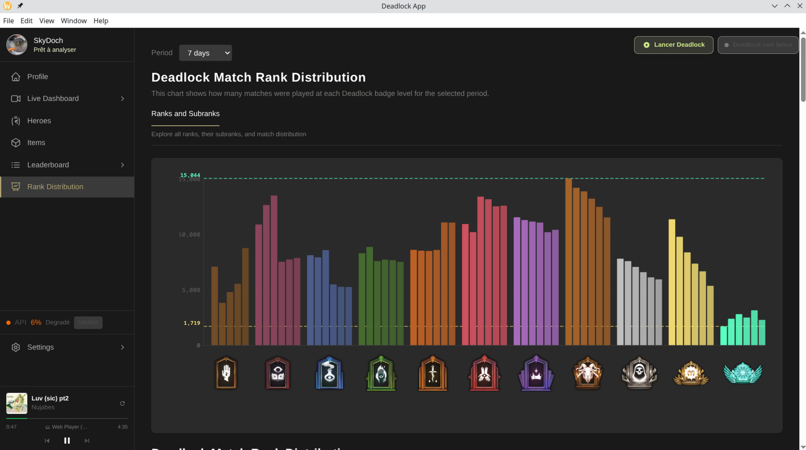
  <br/>
  <em>Rank Distribution — répartition globale des joueurs par rang avec pourcentages au survol</em>
</p>

### Widget Spotify

Le widget Spotify, intégré dans la sidebar et disponible en overlay, permet de contrôler la lecture musicale sans quitter le jeu. Après une authentification OAuth, les boutons Précédent, Play/Pause, Suivant, la pochette d'album, le titre et l'artiste sont affichés avec une actualisation automatique toutes les 5 secondes via `GET https://api.spotify.com/v1/me/player/currently-playing`.

<p align="center">
  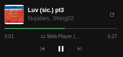
  <br/>
  <em>Widget Spotify — contrôle de lecture intégré avec pochette d'album, titre et barre de progression</em>
</p>

### Overlay en jeu

L'overlay s'affiche par-dessus Deadlock (fenêtre transparente, `always-on-top`, sans frame) dès que le jeu est détecté. Il présente les suggestions d'items contre la composition adverse, un timer de match synchronisé sur l'heure de début détectée localement, et les informations de la piste Spotify en cours. Sur KDE Plasma + Wayland, une règle KWin est automatiquement appliquée pour maintenir l'overlay au-dessus du jeu en plein écran.

<p align="center">
  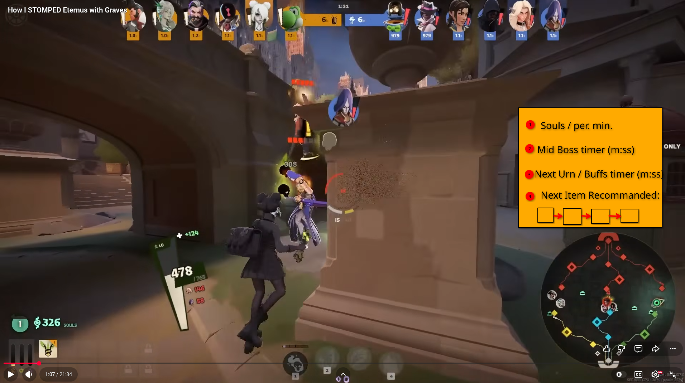
  <br/>
  <em>Overlay en jeu — fenêtre transparente always-on-top avec suggestions d'items et timer de match</em>
</p>

---

## Choix techniques

### Vanilla TypeScript avec architecture orientée classes

Le renderer est construit en TypeScript pur, sans framework UI (pas de React, pas de Vue). Chaque page et composant est une classe TypeScript qui instancie et manipule directement le DOM via `document.createElement`, `innerHTML` et des `CustomEvent`. Ce choix délibéré démontre une maîtrise approfondie du DOM et du cycle de vie du navigateur, sans la couche d'abstraction qu'un framework imposerait. L'architecture en classes facilite l'encapsulation de l'état local et la réutilisation des composants (ex. `PlayerCard`, `SpotifyMiniPlayer`) sans outillage supplémentaire.

### Détection de match par log-watching

La détection de partie repose sur la lecture du fichier de logs local de Deadlock (`console.log` activé via le flag `-condebug`), et non sur l'endpoint `/v1/matches/active` de l'API communautaire. Cette décision est fondée sur une contrainte réelle : `/matches/active` ne retourne que les 200 parties les plus regardées — une partie normale d'un joueur lambda n'y apparaît jamais. Le `LogWatcher` (`src/main/log-watcher.ts`) surveille le fichier en temps réel et émet les événements `match-started` et `match-ended` dès que les lignes caractéristiques apparaissent dans le log. L'API communautaire reste utilisée en fallback best-effort (sondage toutes les 20 secondes) pour enrichir l'overlay avec les données de roster, mais ne peut jamais mettre fin à un match détecté localement.

### Spotify OAuth avec credential override au runtime

Les identifiants Spotify (Client ID, Client Secret) ne sont pas compilés dans le binaire de production. Au démarrage, `spotify-logic.ts` cherche d'abord un fichier `spotify-credentials.json` dans le répertoire de données utilisateur (`~/.config/DeadlockHelper/` sur Linux, `%APPDATA%\DeadlockHelper\` sur Windows). Si le fichier existe, il prend la priorité absolue sur les variables d'environnement du build. Cette architecture permet à n'importe quel utilisateur de connecter ses propres identifiants Spotify sans recompiler l'application, et garantit qu'aucun secret n'est baked dans les binaires distribués. Le flux OAuth utilise un serveur HTTP local éphémère sur `127.0.0.1:30765` pour capturer le code d'autorisation — jamais exposé sur le réseau local.

---

## Réflexion technique — Worker OCR (roster live)

### Ce qui a été implémenté

Le worker Python `ocr-worker/main.py` lit l'écran `ESC › PLAYERS` de Deadlock grâce à la bibliothèque EasyOCR et extrait le roster live en deux colonnes : `myTeam` et `enemyTeam`. Chaque entrée contient le pseudo Steam (best-effort, affichage uniquement) et le `hero_id` mappé via fuzzy-match sur un vocabulaire fermé de 28 héros. Les résultats sont émis en NDJSON sur stdout (canal IPC natif vers Electron). Le taux de reconnaissance des héros est de **100 % (12/12)** validé sur l'image de référence `src/assets/Images/NameSearch.png`.

Deux moteurs ont été évalués en conditions réelles sur la même image de référence :

| Approche | Résultat héros | Déterminisme |
|---|---|---|
| Tesseract + OpenCV (HSV white-mask + segmentation) | 0/12 à 12/12 selon la charge CPU | ❌ non déterministe |
| **EasyOCR + thefuzz (image brute)** | **12/12 (100 %)** | ✅ stable |

Tesseract nécessitait ~24 spawns de sous-processus par scan, fragiles sous charge CPU, ce qui produisait des résultats instables sur la même image selon les conditions système. EasyOCR traite l'image brute en un seul appel in-process et s'est révélé entièrement déterministe.

### Pourquoi ce module n'est pas activé en production

**Limitation fondamentale de l'API Steam.** Un pseudo Steam affiché en jeu (`personaname`) n'est pas résolvable en `account_id` : il n'existe aucun endpoint Steam ni deadlock-api de recherche « nom d'affichage → SteamID64 ». La fonction `ResolveVanityURL` ne résout que le slug d'URL personnel (`/id/<slug>`), jamais le nom affiché en jeu. L'OCR peut donc fournir les héros (vocabulaire fermé, fiable) et les pseudos pour l'affichage, mais pas les statistiques par compte (MMR, rang, activité) qui requièrent un `account_id`.

**Intégration Electron non complétée.** Le worker Python fonctionne en isolation (testé en ligne de commande), mais le câblage côté `src/` n'a pas été finalisé dans le délai du projet : spawn/kill du processus long-vécu, lecture ligne par ligne du flux NDJSON, canal IPC `ocr:roster-updated` vers le renderer, et toggle dans la page Paramètres. `python-runner.ts` actuel est conçu pour des scripts one-shot (il attend la fin du processus) et n'est pas adapté à un worker persistant sans refactoring.

**Poids de la dépendance.** EasyOCR requiert PyTorch (CPU-only), ce qui représente un venv de ~1.5 Go. Un bundle PyInstaller incluant PyTorch serait de plusieurs gigaoctets — incompatible avec un binaire de production raisonnable à distribuer.

---


## Stack technologique

L'application est construite avec **Electron Forge** comme toolchain de build et de packaging. Le renderer utilise **Vite** pour la compilation TypeScript et le rechargement à chaud. Le style est géré par **Tailwind CSS** en mode JIT, sans framework CSS externe ni bibliothèque de composants. La persistance des données (profil Steam, tokens Spotify, cache des matchs, awards) est assurée par **electron-store** — un wrapper JSON typé sur `app.getPath('userData')`. Les données de l'API Deadlock communautaire sont transformées par un script **Python 3.12** (`data_processor.py`) appelé en sous-processus par Electron, ce qui permet d'utiliser des bibliothèques Python de traitement de données sans les embarquer dans le bundle Node.js.

---

## Documentation technique

La documentation interne du projet est organisée dans le répertoire `docs/` :

- `docs/adr/` — Cinq Architecture Decision Records documentant les choix non évidents (source des builds, architecture overlay, source du roster live, etc.)
- `docs/ESP_FINAL/` — Documentation de chaque fonctionnalité majeure (Live Dashboard, Overlay, OCR Worker, Rank Distribution, Profil)
- `docs/api-deadlock.md`, `docs/api-steam.md`, `docs/api-spotify.md` — Référence des endpoints utilisés
- `CONTEXT.md` — Glossaire du domaine métier (termes spécifiques à Deadlock utilisés dans le code)

---

## Licence

MIT — voir [LICENSE](LICENSE)
