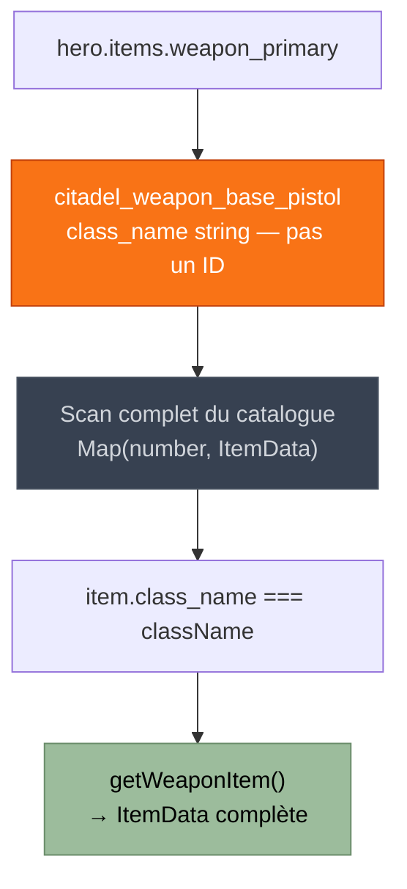
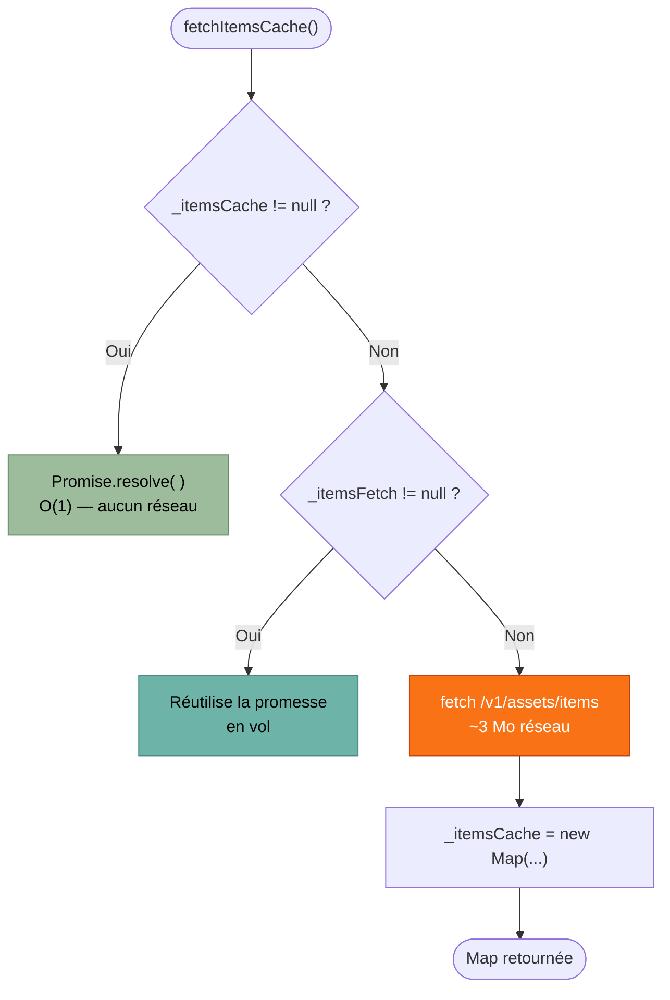
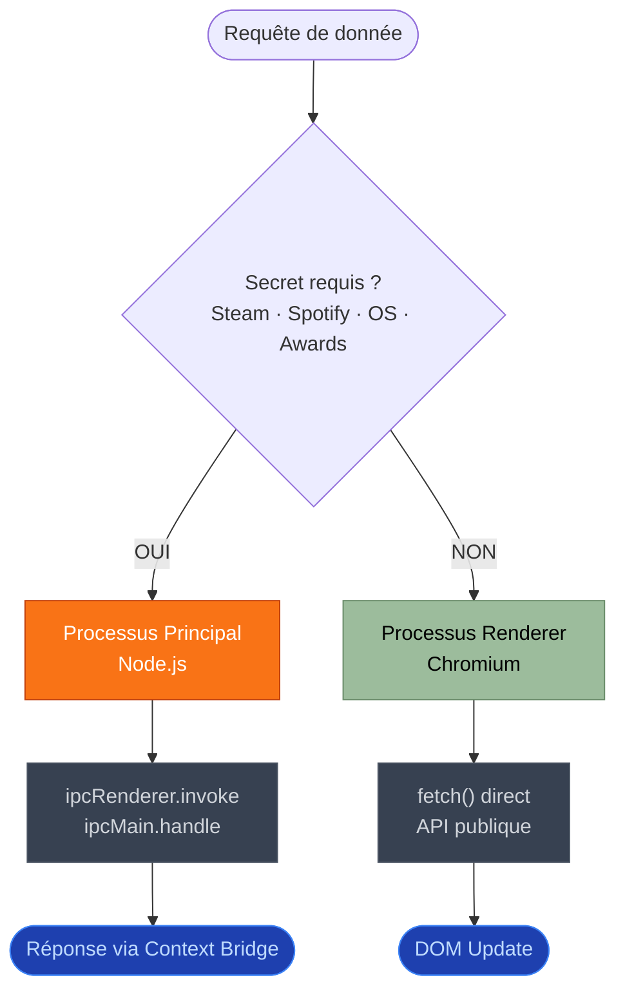

# Le cycle de vie d'une donnée
## Du clic au DOM

<div class="mt-6 text-lg opacity-70">Architecture asynchrone Electron · 6 étapes</div>

<div class="mt-10 grid grid-cols-3 gap-6 text-sm">
  <div class="bg-white/5 rounded-lg p-4 border border-white/10">
    <div class="text-[#9cbc9c] font-bold mb-2">Étapes 1 – 2</div>
    <div class="opacity-60">Événement &amp; Aiguillage</div>
  </div>
  <div class="bg-white/5 rounded-lg p-4 border border-white/10">
    <div class="text-[#f97316] font-bold mb-2">Étapes 3 – 4</div>
    <div class="opacity-60">Fetch parallèle &amp; Payload</div>
  </div>
  <div class="bg-white/5 rounded-lg p-4 border border-white/10">
    <div class="text-[#a855f7] font-bold mb-2">Étapes 5 – 6</div>
    <div class="opacity-60">Cache &amp; DOM</div>
  </div>
</div>

<!--
Je vais maintenant vous démontrer ma compréhension de l'architecture asynchrone d'Electron en suivant le parcours complet d'une donnée — depuis le clic de l'utilisateur sur la carte d'un héros, jusqu'à l'affichage final dans l'interface. Six étapes.

[→ Avancer vers la slide suivante — aucun clic sur cette slide]
-->

---
layout: two-cols
layoutClass: gap-6
---

# Étapes 1 & 2 — L'Événement et l'Aiguillage

**Dispatch — `HeroLibrary.ts`**

```typescript {all|2-7|4-6}
// HeroLibrary.ts — clic sur une carte héros
btn.addEventListener('click', () => {
  document.dispatchEvent(
    new CustomEvent('navigate-hero', {
      detail: { heroId: id, heroData: hero }
    })
  );
});
```

<div v-click class="mt-4">

**Interception — `app.ts`**

```typescript {all|2|4}
document.addEventListener('navigate-hero', (e: Event) => {
  const { heroData } = (e as CustomEvent).detail;
  if (this.contentContainer) {
    this.heroDetailsPage.mountWithHero(this.contentContainer, heroData);
  }
});
```

</div>

::right::

<div class="mt-16 space-y-4 text-sm">

### Découplage total

`HeroLibrary` ne connaît pas `HeroDetailsPage`.

Il émet un **`CustomEvent` natif** — API standard du navigateur, sans dépendance framework.

`app.ts` est le seul point de couplage : il écoute l'événement et délègue à `mountWithHero()`.

<div v-click class="mt-6 p-3 bg-[#9cbc9c]/10 rounded-lg border border-[#9cbc9c]/30 text-xs">

Ajouter une page réagissant au clic d'un héros ne requiert qu'un nouvel écouteur dans `app.ts`.
**Aucune modification de `HeroLibrary`.**

</div>

</div>

<!--
─── SLIDE 2 · 6 clics ───────────────────────────────────────────────
État initial : bloc HeroLibrary.ts entier mis en évidence.

L'utilisateur clique sur la carte du héros Haze dans HeroLibrary. La classe TypeScript HeroLibrary intercepte ce clic.

[clic 1] → lignes 2-7 surlignées (addEventListener complet)
Il dispatche un CustomEvent natif du DOM — c'est la fonction addEventListener sur le bouton.

[clic 2] → lignes 4-6 surlignées (objet detail)
Le detail encapsule deux propriétés : l'identifiant numérique du héros et l'objet HeroData complet.

[clic 3] → bloc app.ts apparaît, entier mis en évidence
app.ts, le routeur central de l'application, écoute cet événement et instancie la page de détail en appelant mountWithHero().

[clic 4] → ligne 2 surlignée (déstructuration heroData)
Il extrait heroData du detail avec une déstructuration.

[clic 5] → ligne 4 surlignée (mountWithHero)
Et délègue l'affichage à heroDetailsPage.mountWithHero().

[clic 6] → encadré vert apparaît dans la colonne droite
Ce découplage est total : HeroLibrary ne connaît pas HeroDetailsPage. Ajouter une page réagissant au clic d'un héros ne requiert qu'un nouvel écouteur dans app.ts — aucune modification de HeroLibrary.
-->

---

# Étape 2 (suite) — Parallélisme Réseau

`mountWithHero()` → `renderSkeleton()` → `fetchAll()`

```typescript {1|1-3|1,5-6|1,8|1,10-11|1,13-14|all}
const [builds, stats, items, abilities, abilityOrder] = await Promise.all([
  fetch(`${API}/v1/builds?hero_id=${id}&sort_by=weekly_favorites&limit=3&only_latest=true&build_language=English`)
    .then(r => (r.ok ? r.json() : Promise.resolve([]))),

  fetch(`${API}/v1/analytics/hero-build-stats/${id}`)
    .then(r => (r.ok ? r.json() : Promise.resolve([]))),

  fetchItemsCache(),

  fetch(`${API}/v1/assets/items/by-hero-id/${id}`)
    .then(r => (r.ok ? r.json() : Promise.resolve([]))),

  fetch(`${API}/v1/analytics/ability-order-stats?hero_id=${id}&min_matches=200`)
    .then(r => (r.ok ? r.json() : Promise.resolve([]))),
]);
```

<div v-click class="mt-3 text-sm p-3 bg-white/5 rounded-lg border border-white/10">

`Promise.all()` lance les 5 requêtes <strong>en parallèle</strong> — temps d'attente = latence de la plus lente, non la somme.

</div>

<!--
─── SLIDE 3 · 7 clics ───────────────────────────────────────────────
État initial : ligne 1 seule surlignée (signature Promise.all).

mountWithHero() appelle immédiatement renderSkeleton() pour afficher l'animation de chargement, puis déclenche fetchAll(). Les données publiques de héros n'ont pas besoin de passer par IPC, parce qu'elles ne requièrent ni secret ni accès système. Le renderer appelle donc directement fetch() vers l'API communautaire. Promise.all() enveloppe cinq requêtes.

[clic 1] → lignes 1-3 surlignées (builds fetch)
La première charge les trois builds les plus favoris de la semaine, filtrés en anglais.

[clic 2] → lignes 1 et 5-6 surlignées (stats fetch)
La deuxième récupère les statistiques de victoire par build.

[clic 3] → lignes 1 et 8 surlignées (fetchItemsCache)
La troisième appelle fetchItemsCache() — le catalogue d'items partagé, mis en cache au niveau du module.

[clic 4] → lignes 1 et 10-11 surlignées (abilities fetch)
La quatrième charge les capacités signature du héros.

[clic 5] → lignes 1 et 13-14 surlignées (abilityOrder fetch)
La cinquième récupère les statistiques d'ordre de compétences, filtrées sur un minimum de 200 parties.

[clic 6] → toutes les lignes surlignées
Les cinq requêtes partent en parallèle et le résultat arrive dès que la plus lente répond — plutôt qu'en séquence, ce qui multiplierait le temps d'attente.

[clic 7] → encadré de récapitulatif apparaît en bas
Promise.all() lance les cinq requêtes en parallèle et attend la plus lente.
-->

---
layout: two-cols
layoutClass: gap-6
---

# Étape 3 — Le Payload API et le Désalignement

```json {all|14-16|15}
{
  "id": 17,
  "name": "Haze",
  "player_selectable": true,
  "disabled": false,
  "images": {
    "icon_hero_card_webp": "https://cdn.../haze_card.webp",
    "background_image_webp": "https://cdn.../haze_bg.webp"
  },
  "starting_stats": {
    "max_health": { "value": 550 },
    "max_move_speed": { "value": 7.0 }
  },
  "items": {
    "weapon_primary": "citadel_weapon_base_pistol"
  }
}
```

::right::

<div class="mt-4">



<div class="mt-3 text-xs opacity-70">

`weapon_primary` n'est pas un ID numérique — c'est une `class_name` string.<br/>
Aucun endpoint de lookup inverse : scan linéaire de toute la Map.

</div>

</div>

<!--
─── SLIDE 4 · 2 clics ───────────────────────────────────────────────
État initial : JSON entier mis en évidence.

Voici à quoi ressemble le JSON brut retourné par l'API pour un héros.

[clic 1] → lignes 14-16 surlignées (bloc items)
Notez le champ items qui contient la référence à l'arme principale.

[clic 2] → ligne 15 seule surlignée (weapon_primary)
weapon_primary est une class_name en chaîne de caractères — pas un identifiant numérique. Pour résoudre la statistique d'arme d'un héros, il faut scanner l'intégralité du catalogue d'items pour trouver celui dont le class_name correspond. C'est ce que fait getWeaponItem() dans HeroDetails.ts.
-->

---
layout: two-cols
layoutClass: gap-6
---

# Étape 4 — Cache Module-Level

```typescript {all|1-2|5|6|7-16|all}
let _itemsCache: Map<number, ItemData> | null = null;
let _itemsFetch: Promise<Map<number, ItemData>> | null = null;

function fetchItemsCache(): Promise<Map<number, ItemData>> {
  if (_itemsCache) return Promise.resolve(_itemsCache);
  if (_itemsFetch) return _itemsFetch;
  _itemsFetch = fetch(`${API}/v1/assets/items`)
    .then(r => (r.ok ? r.json() : Promise.resolve([])))
    .then((arr: ItemData[]) => {
      _itemsCache = new Map(arr.map(i => [i.id, i]));
      return _itemsCache;
    })
    .catch(() => {
      _itemsFetch = null;
      return new Map<number, ItemData>();
    });
  return _itemsFetch;
}
```

::right::

<div class="mt-4">



<div class="mt-3 text-xs opacity-70">

Résolution $O(1)$ si en cache — simple null-check, pas de hashage supplémentaire.<br/>
Déduplication de promesses : une seule requête réseau même si deux héros sont cliqués simultanément.

</div>

</div>

<!--
─── SLIDE 5 · 5 clics ───────────────────────────────────────────────
État initial : code entier mis en évidence.

Le catalogue d'items complet fait environ 3 Mo. Je ne veux pas le re-télécharger à chaque navigation entre héros.

[clic 1] → lignes 1-2 surlignées (variables de portée module)
La solution : deux variables à portée module, déclarées en dehors de la classe. Elles survivent aux navigations entre héros.

[clic 2] → ligne 5 surlignée (vérification _itemsCache)
Si _itemsCache est déjà rempli, on retourne immédiatement une promesse résolue — résolution en O(1), aucun réseau.

[clic 3] → ligne 6 surlignée (vérification _itemsFetch)
Si _itemsFetch est déjà en vol, on retourne la même promesse — c'est la déduplication de promesses.

[clic 4] → lignes 7-16 surlignées (fetch + stockage)
Sinon seulement, on lance le fetch réseau, on construit la Map, et on la stocke dans _itemsCache.

[clic 5] → code entier remis en évidence
Cette technique — appeler _itemsFetch si une requête est déjà en vol — s'appelle la déduplication de promesses. Si deux héros sont cliqués rapidement avant que le catalogue soit chargé, une seule requête réseau est émise.
-->

---

# Étape 5 — Hydratation Dynamique du DOM

```typescript {all|11-14|14}
private renderHeader(): string {
  const bgUrl = this.hero?.images?.background_image_webp ?? '';
  const name  = this.hero?.name ?? 'Unknown Hero';
  return `
    <div class="sticky top-0 z-50">
      <div style="background-image:url('${bgUrl}'); background-size:cover;">
        <h1 class="text-3xl font-bold text-white">${name}</h1>
      </div>
      <div class="flex px-8">
        ${TABS.map(t => `
          <button data-tab="${t.id}"
            class="${this.currentTab === t.id
              ? 'text-dry-sage-400 border-dry-sage-400'
              : 'text-grey-500 border-transparent'}">
            ${t.label}</button>`).join('')}
      </div>
    </div>`;
}
```

<div v-click class="mt-3 text-sm p-3 bg-white/5 rounded-lg border border-white/10">

`.join('')` injecte les 5 boutons en <strong>un seul bloc HTML</strong> → <code>container.innerHTML = ...</code> provoque <strong>un seul reflow</strong> navigateur, peu importe le nombre d'onglets.

</div>

<!--
─── SLIDE 6 · 3 clics ───────────────────────────────────────────────
État initial : code entier mis en évidence.

Une fois toutes les promesses résolues, render() génère l'HTML via des template literals et des boucles TypeScript.

[clic 1] → lignes 11-14 surlignées (bloc TABS.map)
TABS.map(t => ...) génère les cinq boutons d'onglets avec leurs classes Tailwind conditionnelles selon l'état actif.

[clic 2] → ligne 14 seule surlignée (.join(''))
Le .join('') concatène tous les boutons en un seul bloc de texte HTML.

[clic 3] → encadré récapitulatif apparaît en bas
Le container.innerHTML = ... remplace entièrement le DOM précédent en un seul reflow navigateur, puis bindEvents() réattache les écouteurs d'événements sur les nouveaux nœuds.
-->

---
layout: center
---

# Étape 6 — Synthèse Architecturale



<div class="mt-4 text-sm text-center opacity-70">

Séparation de responsabilités rigoureuse — les secrets ne quittent jamais le processus principal.

</div>

<!--
─── SLIDE 7 · 0 clic ────────────────────────────────────────────────
Slide statique — lire le texte, puis avancer vers la section suivante.

Et c'est ici que les deux architectures convergent : pour les données qui nécessitent des secrets — Steam, Spotify, game detection, awards — tout passe par IPC. Pour les données publiques — héros, builds, items — le renderer fetch directement. C'est une séparation de responsabilités rigoureuse.

[→ Avancer vers la section 5 — Logique Métier Avancée]
-->
